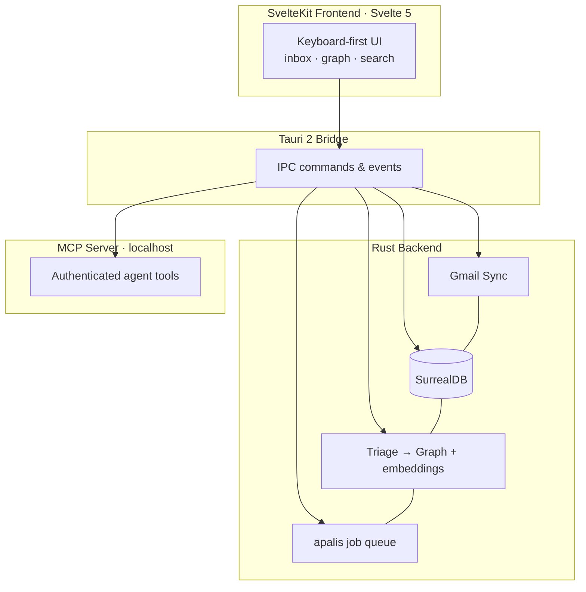
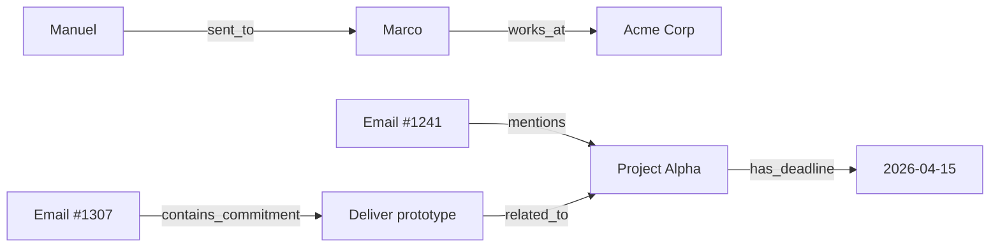

In the [first post](/blog/done-why-i-built-my-own-email-client), I explained why I started building Done: an email client designed around understanding, not just speed. This post is the technical deep dive. How the system actually works, where the complexity hides, and why "just a Gmail wrapper" is the wrong mental model.

## Architecture Overview

Done is a crate-heavy Rust workspace behind a SvelteKit UI. At a high level:

The Rust backend does the heavy lifting: syncing Gmail accounts, storing mail and graph data locally in SurrealDB, running triage and the extraction pipeline, and exposing operations through both Tauri commands and a local MCP server. The SvelteKit frontend talks to Rust through Tauri's IPC bridge.

## Choosing Tauri Over Electron

This was an easy decision. Electron ships an entire Chromium instance. For an app you keep open all day, that's 200+ MB of RAM before you've loaded a single email. Tauri uses the system's native webview and a Rust backend:

- **Memory:** Done idles at ~80 MB. A comparable Electron app would be 300+.
- **Binary size:** ~15 MB versus 150+ MB for Electron.
- **Backend performance:** Rust's concurrency model is a good fit for parallel email fetching, parsing, and graph operations.
- **Security:** Tauri's permission model is stricter by default. The frontend can only call explicitly exposed Rust commands.

The tradeoff is ecosystem maturity. Electron has ten years of battle-tested patterns. Tauri's plugin ecosystem is younger, and some things that are trivial in Electron (system tray, notifications, auto-updates) take more manual work. Still worth it for an always-on app.

## The Gmail Sync Problem

This is where the "just a wrapper" idea falls apart. Gmail's API is powerful but opinionated, and reliable sync on top of it is hard. Done supports multiple Gmail accounts, and each one multiplies the edge cases.

### Initial Sync

The first time you connect an account, Done needs to pull thread history. It lists threads in pages (100 IDs per page), then fetches each thread's messages. For an account with 50,000 emails, that's:

1. Hundreds of list requests
2. Tens of thousands of message/thread fetches
3. Gmail quota limits that punish naive sequential loops

Done parallelizes work with Tokio and throttles requests so we stay inside Gmail's rate limits. Initial sync for a heavy inbox still takes minutes, not seconds, and multi-account makes that cost additive.

But speed isn't the hard part. Data consistency is.

### Incremental Sync

After the initial pull, Done uses Gmail's `history.list` endpoint with a stored history ID to fetch only changes: messages added, labels changed, threads updated. A background job queue (apalis) drives periodic sync and other work. We do not use Google Cloud Pub/Sub. Polling plus history IDs is less glamorous than push, but it's reliable and doesn't need a public webhook endpoint for a desktop app.

Sounds clean. In practice:

- **History IDs expire.** Gmail only keeps history for a limited window. If Done hasn't synced in a while, the history ID may be invalid, and you need to fall back to a full re-sync reconciliation.
- **Label changes are tricky.** Gmail's label system is more complex than folders. A message can have multiple labels, and "removing from inbox" is actually "removing the INBOX label," not moving the message. Done's local model has to mirror that.
- **Drafts are mutable.** Unlike sent messages, drafts change. The same draft ID can have completely different content between syncs.
- **Batch operations on Gmail's side.** If a user archives 500 messages on Gmail's web client, Done receives a flood of history events. Processing those without hammering the UI needs careful batching and optimistic local updates with rollback on failure.

### Offline, Retention, and Conflict Resolution

Done stores emails locally in SurrealDB (embedded RocksDB). You can read, search, and triage offline. When you come back online, local actions need to sync back to Gmail:

- You archived an email locally. Did someone also reply to that thread while you were offline? The archive still applies, but the thread now has new messages.
- You labeled an email locally. Did someone else (or a Gmail filter) also modify labels? Labels are additive, so this usually merges cleanly, but edge cases exist.

For archived mail, a body retention policy can trim full HTML bodies over time to keep the local database lean. When you need the full content again, Done re-fetches the thread from Gmail. Agents can do the same through an MCP tool.

The current approach is last-write-wins for label operations with thread-level awareness for structural changes. Not perfect, but it handles most real-world scenarios without user intervention.

## The RAG Extraction Pipeline

This is the heart of what makes Done different, and the most complex subsystem to build.

### Why GraphRAG, Not Vector Search

Standard RAG works like this: chunk documents, embed chunks, store vectors, query with similarity search. It works well for "find me emails about X" but poorly for "what commitments do I have with Acme Corp this quarter?"

The second query needs relationships between entities across multiple emails. Vector similarity will find emails that mention Acme Corp, but it won't connect a deadline in email A with a deliverable in email B with a person introduced in email C.

GraphRAG builds a knowledge graph during indexing:

When you query "what did I promise Acme?", the system traverses the graph from Acme Corp through related projects, commitments, and deadlines. The answer is assembled from multiple emails without any single email containing the full picture. Done also supports multiple query modes (local, global, hybrid, mix, naive) so retrieval can lean on graph structure, vectors, or both.

### Triage Before Extraction

Not every email deserves a full LLM pass. Before extraction, a triage layer classifies messages into categories like direct communication, knowledge-rich content, transactional mail, and noise. Heuristics run first. Graph context can refine low-confidence decisions. Only messages that need it get embedded, summarized, or written into the knowledge graph. That filter is what makes GraphRAG affordable on a real inbox.

### The Extraction Pipeline

Emails that pass triage go through a multi-stage pipeline.

**Stage 1: Parsing.** Strip HTML, extract plain text, identify quoted text (previous replies), parse headers. Email HTML is notoriously inconsistent. Every client generates different markup. Custom parsers and heuristics extract clean text for the model.

**Stage 2: Entity extraction.** Identify people, organizations, dates, monetary amounts, project names, and action items. Extraction runs through a pluggable chat provider: Ollama for fully local work, or cloud providers (Gemini, Groq, Cerebras, and others) when you opt in. Token usage and cost are tracked per call so you can see what GraphRAG actually costs.

**Stage 3: Relationship mapping.** Connect extracted entities to each other and to existing graph nodes. If Marco from Acme Corp was already in the graph, the new email's mentions get linked to the existing entity rather than creating duplicates. Entity resolution (deciding that "Marco," "Marco R.," and "marco.rossi@acme.com" are the same person) is harder than it sounds.

**Stage 4: Graph insertion.** Entities and relationships land in SurrealDB's graph tables alongside email records. One local database holds mail, vectors, graph, jobs, and settings.

**Stage 5: Embedding.** Email chunks and entity descriptions get embedded for hybrid retrieval: graph traversal for structured queries, vector similarity for fuzzy ones. Embeddings default to local models via fastembed, with an optional remote embedder.

### Performance Considerations

Running an LLM extraction pipeline on every email would be ruinous. What makes it viable:

- **Triage first.** Noise never reaches the expensive stages.
- **Background jobs.** Sync, embedding, graph work, retention, and triage run on a job queue you can pause and resume from the UI.
- **Prioritized processing.** Inbox and high-value mail jump the queue. Bulk historical sync runs in the background.
- **Incremental updates.** New emails add to the graph. They don't trigger a full rebuild.
- **Caching.** Re-synced messages skip extraction unless content changed.

On a modern laptop, background indexing is fast enough that you don't notice it during normal use. Initial indexing of a large inbox still takes a while. That's the real cost of understanding your mail.

## The MCP Server

This is the feature that points furthest forward, with a more modest surface area than the hype usually implies.

Done runs a local MCP server (HTTP/SSE on localhost, configurable port, disabled by default). Agents authenticate with API keys and get an explicit permission set. Every write action is attributed to a user or agent in an activity log.

Through MCP today, an assistant can:

- List threads by label (inbox, starred, etc.) across accounts
- Read thread and email content, including re-fetching trimmed bodies
- List labels for an account
- Mark as read, archive / unarchive, apply labels
- Snooze and unsnooze threads

What it does _not_ expose yet: natural-language GraphRAG search, compose/send, or direct graph queries. Those live in the app UI today. The next step is opening graph and search tools to agents so a briefing like "what needs my attention today?" can be assembled without switching windows.

What already works well is composition of primitives. A morning workflow with a connected agent:

1. List inbox threads across accounts
2. Pull full content for the ones that look important
3. Archive or snooze the rest with permission
4. Leave a trail in the activity log so I can see what the agent did

The MCP server means Done isn't limited to what I build into the UI. Custom triage bots, CRM glue, or follow-up systems can sit on the same local data plane, with auth and an audit trail.

## The SvelteKit Frontend

The frontend is keyboard-first on purpose. Superhuman proved that pattern works for email. I borrowed the principle:

- **Single-key actions.** Archive, reply, navigate, search, all without reaching for the mouse.
- **Command palette.** `Cmd+K` for labels, account switching, settings, and power actions.
- **Split views.** Thread list and message content, plus dedicated routes for archive, sent, search, graph, activity, and settings.
- **Light and dark themes.** System preference by default. Your choice either way.

Svelte 5's reactivity keeps the UI responsive without a virtual DOM tax. State changes from the Rust backend (new mail, sync status, job progress) flow through Tauri's event system into rune-based stores. Optimistic archive/unarchive updates the UI immediately and rolls back if Gmail rejects the action. There's also an AI writing assistant in compose for drafting replies without leaving the client.

## What This Stack Looks Like in Practice

A typical flow when new mail arrives:

1. The job queue wakes the sync worker for each connected account
2. Rust calls Gmail `history.list` from the last history ID (or falls back to reconciliation)
3. New messages are parsed and stored in SurrealDB
4. Tauri emits events. The SvelteKit UI updates the thread list
5. Background: triage classifies the mail. Embedding and graph jobs run when appropriate
6. Background: MCP tools see the same storage. Agents and UI share one source of truth

Steps 1 through 4 feel near-instant for a small delta. Graph and embedding work finish in the background depending on provider, triage outcome, and how deep the backlog is.

## Series

1. [Why I Built My Own Email Client](/blog/done-why-i-built-my-own-email-client)
2. **This post:** architecture, Gmail sync, GraphRAG, MCP
3. [What Building an Email Client Taught Me](/blog/done-lessons-learned)

## Coming Up

In the [final post](/blog/done-lessons-learned), I'll talk about what surprised me most during this build, the complexities I underestimated, and where Done is heading next.

---

_If you're building with Tauri, GraphRAG, or MCP, I'd love to hear about your experience. Find me on [Twitter](https://x.com/iltumio) or [LinkedIn](https://linkedin.com/in/manuel-tumiati)._
