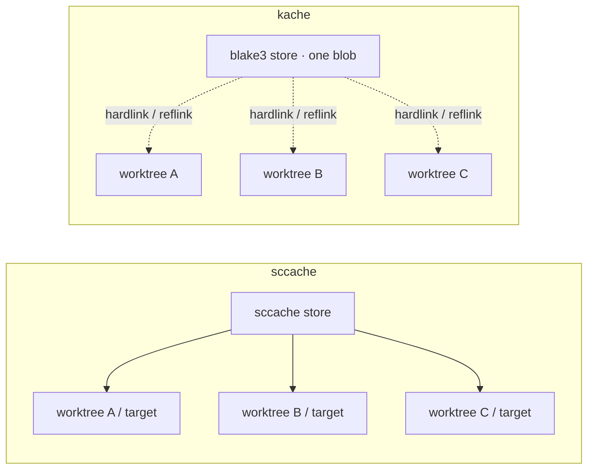

I have been running [sccache](https://github.com/mozilla/sccache) as `RUSTC_WRAPPER` for years. It is the default good answer if you compile a lot of Rust: drop it in, keep using Cargo, stop paying the full `tokio` / `serde` / `tauri` tax every time you `cargo clean` or switch machines.

Then the problem stopped being compile time. It became disk.

I keep several checkouts of the same repos around. [Done](/blog/done-building-with-rust-graphrag-and-mcp) is a crate-heavy Tauri workspace. Day-job repos live in their own trees. Agent sessions and review branches get worktrees. Each one grows a `target/` directory that looks unique to `du` and feels identical to anyone who has compiled the same crates this week.

sccache was skipping the compiles. It was not stopping me from storing the same `.rlib` four times.

That is the gap [kache](https://github.com/kunobi-ninja/kache) is built for. Kunobi [open-sourced it](https://kunobi.ninja/blog/open-sourcing-kache) as a next-generation `sccache`: still a drop-in wrapper, but with a content-addressed local store and zero-copy restores. I switched. I am staying.

## What sccache was actually doing for me

sccache sits in the same slot kache does:

```toml
[build]
rustc-wrapper = "sccache"
```

Cargo invokes the wrapper instead of `rustc`. The wrapper hashes the compile inputs, looks for a hit, and either restores the artifact or lets the real compiler run and stores the result. Local disk or S3, same idea. I never had to change how I invoked Cargo.

For a long time that was enough. Cold CI jobs got cheaper. A `cargo clean` on a laptop was annoying instead of catastrophic. The wrapper was invisible, which is what you want from a cache.

The part I stopped liking is that a cache hit still *materializes* a file in `target/`. sccache answers "have I compiled this crate before?" It does not answer "do I already have this exact blob on disk, and can every worktree share it?"

On a single checkout that distinction is academic. With three or four worktrees of the same workspace, it is the whole story. `target/debug/deps` is where the disk goes, and most of those bytes are the dependency graph, not my code.

## The thing I wanted

I wanted one local copy of equivalent artifacts. I wanted the next worktree to hardlink them into place instead of writing another 800 MB of `syn` and `axum`. I wanted to see hits and misses without scraping log lines. I did not want a new build system.

kache's pitch matches that list almost one for one:

- Same `RUSTC_WRAPPER` contract. Cargo does not change.
- Artifacts keyed by blake3 of normalized compiler inputs.
- Hits restore with a reflink where the filesystem supports it, a hardlink otherwise, a copy only if those are impossible.
- A TUI for health, misses, and deduplicated bytes.
- Optional S3-compatible sync and a [GitHub Action](https://github.com/kunobi-ninja/kache-action) when local-only is no longer enough.

The important sentence from their announcement is the one that made me install it: this is not "sccache, but again." It is a cache that treats local artifacts as something to manage, not just something to reuse opportunistically.

## How the switch actually went

I did not hand-edit `~/.cargo/config.toml` and hope. kache has an explicit migration path.

```bash
# install
cargo binstall kache
# or: mise use -g github:kunobi-ninja/kache@latest

kache init
kache doctor --fix --purge-sccache
kache doctor
```

`kache init` writes the wrapper into `$CARGO_HOME/config.toml`, installs the background daemon as a user service, and starts it. `kache doctor --fix` repairs the wrapper setup if something is still pointing at sccache. `--purge-sccache` removes the old cache and binary once the new wrapper is in place.

After that, Cargo looks the same:

```bash
cargo build
```

The first build after a switch is a miss storm. That is expected. kache has to see each crate compile once before the store has anything to restore. The second build, or the first build in a sibling worktree, is where the difference shows up.

I kept one habit from the sccache days: if a crate starts behaving strangely, I assume the cache before I assume rustc. `kache why-miss <crate>` exists specifically for that, which is already more than I had before.

## Why hardlinks (and reflinks) are the actual feature

This is the part that changed my day-to-day, not the TUI and not S3.

```
~/.cache/kache/store/blobs/
  └── ab/cd1234...          ← one physical copy

workspace/
  ├── main/target/debug/deps/libfoo.rlib      → same inode
  ├── feat-search/target/debug/deps/libfoo.rlib
  └── review-pr/target/debug/deps/libfoo.rlib
```

sccache can skip the compile in all three trees. kache can skip the compile *and* skip the second and third copies. `du` on each `target/` still reports the logical size. `df` is the number that drops.

On Linux the restore path is:

1. **Reflink** if the filesystem can clone (btrfs, XFS with reflink). Copy-on-write, one physical extent.
2. **Hardlink** otherwise (ext4 is the common case). Same inode, no extra blocks.
3. **Copy** only if the store and the `target/` live on different filesystems.

That last case is worth knowing. Hardlinks do not cross mount points. If your repos live on a second disk and `~/.cache/kache` lives on the root volume, kache still caches, it just cannot deduplicate. Keep the store and the worktrees on the same filesystem if disk is why you switched.

There is a related design choice: while kache is the wrapper, it disables rustc incremental compilation and strips incremental flags even when caching is off. Incremental and a content-addressed artifact cache are two different ideas of "reuse," and mixing them is how you get corrupt or unshareable outputs. I notice this most on tight edit-compile loops of a single crate I own. Dependency-heavy rebuilds, which is most of my time, get faster.



## Visibility was the other half

sccache's stats exist. I almost never opened them. The cache was a black box that either helped or mysteriously did not.

kache is built to be inspected:

| Command | What I use it for |
| --- | --- |
| `kache monitor` | Live hits, misses, and dedup bytes while a build runs |
| `kache stats` | Same numbers without a TUI, good for scripts |
| `kache why-miss <crate>` | The question I used to answer by deleting the cache |
| `kache list` | What is actually in the store, by crate |
| `kache clean` | Find `target/` directories and see how much is already cached |
| `kache gc` | LRU / age eviction when the store itself gets fat |
| `kache config` | Store size and remotes without hand-editing TOML |

`kache clean` is the command I did not know I needed. Rust build output accumulates quietly. I used to `find ~ -type d -name target` and delete things by gut feel. Now I can see which `target/` dirs are already represented in the store and delete the copies with less superstition.

The daemon is optional for local hits. If it is not running, local restore and store still work. Remote checks, uploads, and prefetch degrade. I left the user service installed. One less thing to remember.

## I did not need S3 on day one

kache is useful as a local-only cache. That is how I run it.

Remote sharing is there when I want it: any S3-compatible backend (AWS, MinIO, Ceph, Cloudflare R2), or `kache-action` in GitHub Actions. The action can sit on GitHub's own cache as an on-ramp, or point at a bucket and share artifacts across machines and repos.

```yaml
- uses: kunobi-ninja/kache-action@v1
  with:
    s3-bucket: rust-build-cache
    s3-endpoint: https://minio.internal:9000
    s3-access-key-id: ${{ secrets.S3_ACCESS_KEY_ID }}
    s3-secret-access-key: ${{ secrets.S3_SECRET_ACCESS_KEY }}
    manifest-key: release-${{ runner.os }}-${{ runner.arch }}
```

`manifest-key` is the detail I care about for later. Release, test, and clippy jobs can share a bucket without trampling each other. `min-compile-ms` can skip prefetching crates that are cheaper to rebuild than to download.

I am not flipping CI over in this post. Local disk was the reason I switched. Shared cache is the reason I will keep watching the project.

kache also wraps `cc` / `c++` now, with a conservative miss-rather-than-wrong-object policy, and those artifacts are local-only. I have not put that in front of a C toolchain yet. Rust was the pain.

## What I would tell someone still on sccache

Switch if any of these are true:

- You keep more than one checkout or worktree of a non-trivial Rust workspace.
- `target/` is a storage problem, not just a "wait for rustc" problem.
- You want to see *why* a crate missed instead of deleting `~/.cache/sccache` and moving on.
- You want a migration that does not involve archaeology in `config.toml`.

Stay on sccache if:

- You have one `target/` and the cache already hits enough that you do not think about it.
- You depend on rustc incremental for a tight inner loop and do not want that disabled.
- You need a tool that has been the ecosystem default for years and you do not want to be an early production user.

kache is younger. Mozilla's sccache has the scars. I am fine being slightly early in exchange for a store that matches how I actually work.

The commands I would run on a second machine:

```bash
cargo binstall kache
kache init -y
kache doctor --fix --purge-sccache
```

Then build the workspace you already have. Judge it on the second worktree, not the first compile.

**kache:** [github.com/kunobi-ninja/kache](https://github.com/kunobi-ninja/kache)
**Announcement:** [kunobi.ninja/blog/open-sourcing-kache](https://kunobi.ninja/blog/open-sourcing-kache)
